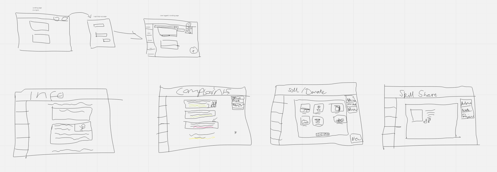

# Florinit

## Description

Florinit is a site is dedicated to providing information and resources for the residents of Florin, a beautiful English town with an old Castle and a country-wide famous Fish and Chips. The site is built using HTML, CSS and Javascript. The site relies on a database to store all the information and requests.

Deployed Site:

## App Design and Development

### User Stories

The Project was managed using Trello. The Trello board can be viewed HERE. The Trello board was used to create user stories and to track the progress of the project. The user stories were created to help guide the development of the apps key features. These user stories were related to some of the initial quotes from the brief:

"”The local recycling centre is overflowing with stuff that can still be reused, Why do people do this? I'm pretty confused."

- This inspired the creation of the donations page. This page allows residents to post items they want to give away. This is a great way to reduce waste and to help the community.

"There is much skill in the local community. Knowledge and crafts have been handed down, generation to generation, but now much of this knowledge is not being shared as regularly, and, as a result, is in danger of being forgotten."

- This inspired the creation of the tips page. This page allows residents to share their tips and tricks. This is a great way to share knowledge that is important.

"Florin is surrounded by swathes of beautiful countryside, where many great and legendary historical events have taken place. Unfortunately, much of this is becoming increasingly destitute and our local landscape is becoming unrecognizable."

- This inspired the creation of the information page. This page contains information about the history of Florin, as well as information about local attractions. The donations page also helps to combat the issues of the landscape.

### Wireframes and Design

Wireframes were created to help guide the development of the app. An initial set of sketches was made using Excalidraw. These were used to jot down initial ideas and channel them into the shape of an app.

[](Wireframes)

### Database Design

## Features

### Landing Page

When you first visit the site, you will be greeted by the landing page. This page contains a brief description of the site and a link to the different pages on the site. The landing page is very static and is simply a navigation tool for users when they first log in.

### Information Page

This page contains helpful information about Florin, including its history, attractions, and local events. It's a great resource for residents and visitors alike. It is the most static page on the site, and is only updated by the site admin.

### Tips Page

The tips page is filled with a range of life hacks. Ranging from random household cleaning tips to energy-saving tips. The tips are submitted by residents. The admin can also delete any tips that are no longer relevant.

### Complaints Page

The complaints page is a place where residents can post their complaints and have them addressed by the site admin. The page relies on an upload form to submit complaints. The admin can then approve or deny each complaint before it goes live. The admin can also delete any complaints that are no longer relevant. Being able to vote on complaints also allows the community to have a say in what is important to them.

### Donations Page

On the donations page, residents can make their own listings for products and services they want to give away. Sometimes it can include paid items, but that will be specified. The admin can approve each product listing before it goes live.

### Admin Features

A lot of specific interactions with the database are only available to the admin. This includes the ability to approve or deny complaints, and to approve or delete product listings. The admin can also delete any tips that are no longer relevant. 

### Future Features

-   Admin ability to update information on the information page
-   Notification alerts for users and admins.
-   User settings and profile pages.
-   Messaging services for community interaction.

## Technologies Used

### Languages

-   HTML
-   CSS
-   Javascript
-   npm (nodemon, express, pg, dotenv, cors, jest, supertest)
-   SQL

## Bugs and Conflicts

During the development of this project, we encountered a number of bugs and conflicts. Primarily conflicts that come from the use of multiple branches and the merging of those branches. However some conflicts were in the actual code itself. This was especially true when it came to the use of the database. We had to make sure that the database was set up correctly and that the correct information was being sent to the database. There was a point in development where two separate functions were interacting with the database at the same time. We figured out a solution in creating a separate database to handle different models. We also ensured to communicate when simultaneous development was taking place.

## Testing

## Local Installation

### Clone the Repository

To get started with a local version of the site, you can clone the repository from GitHub. This is done simply in your terminal using the following command:

```
git clone https://github.com/mikevic18/team-hip-hip
```

### Install Dependencies

Once you have cloned the repository, you will need to install the dependencies. This is done using the following command:

```
npm install -d
```

You should also create a .env file in the backend folder. This file should contain the following:

```
PORT=3000
DB_URL = "Link your own DB here using whatever source you want"
```

To connect to the database, you will need to create a database using the following command:

```
npm run setup-db
```

### Run the Server

To run the server, you can use the following command:

```
npm start
```

The server should now be running on localhost:3000. You can now access the site in your browser by using your VScode or choice of code base to Go Live with the HTML and it will communicate with your local server.

## Credits

### Developers

-   Jojo
-   Rosie
-   Mihai
